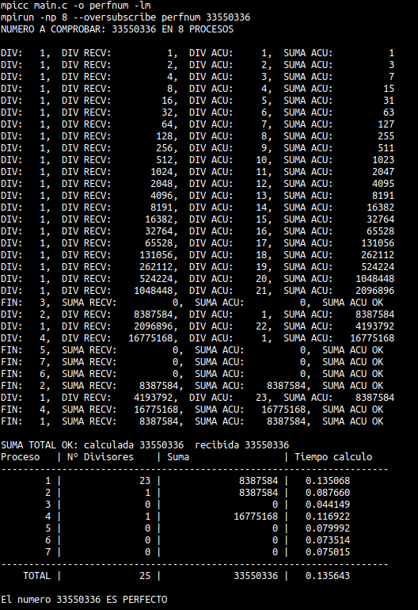

# MPI PERFECT NUMBER CALCULATION
Check if a number is perfect or not using MPI (Message Passing Interface) library in C, dividing the work into different processes, increasing calculation speed.
 (For more information click [here](Practica_MPI.pdf))
 
 <p align="center">
  
</p>

## Usage
To compile and run this code, its needed **OpenMPI**. You can install it using this command:
```sh
sudo apt-get install openmpi-bin
```

Open **"PerfectNumber_Proyect" folder** and run:
```sh
make run <number of processes> <number to check>
```

There are some other options working in the Makefile:
- Compile and not run the code
```sh
make perfnum
```

- Execute **tiempos.sh** with default processes and number to check.
```sh
make times
```
This script is used to get a list of the execution times with different processes to check if the number given is perfect or not (same result as running several times the program incrementing processes for each execution). 
This script can be also executed specifying arguments:
```sh
tiempos.sh <max number of processes> <number to check>
```


- Clean folder and leave only code files.
```sh
make clean
```
